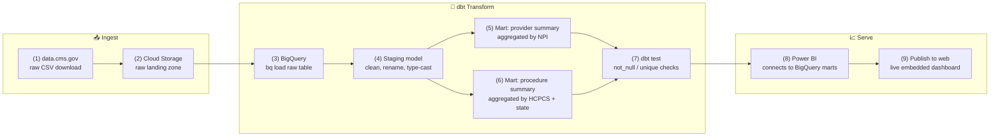

# Add this section to projects.md, after the Meeting Intelligence Agent section

---

## 📊 Medicare Data Pipeline: Raw Data to Production Dashboard {#medicare-data-pipeline}
**Type:** Data Engineering / Cloud Data Pipeline
**Stack:** Google Cloud Storage, BigQuery, dbt, Power BI

A real, working pipeline built on public CMS Medicare provider/payment
data — de-identified, public-domain data, no PII — carried end to end from
raw CSV to a live production dashboard. Built specifically to demonstrate
cloud-native data warehousing and transformation (BigQuery + dbt), not just
a script that reads a CSV.

**Highlights**
- Raw CMS provider/service data (millions of rows) landed in Cloud Storage, loaded to BigQuery, modeled with dbt
- Staging layer normalizes and types raw fields; production marts aggregate to provider- and procedure-level summaries
- dbt-defined tests (not_null, unique) enforce data quality on every run
- Power BI connects directly to the BigQuery production marts — no manual export/import step

### 🧩 Workflow Diagram

### 📊 Medicare Data Pipeline — Diagram

**Workflow Steps**

1. **Source:** Download the CMS "Medicare Physician & Other Practitioners - by Provider and Service" CSV from data.cms.gov
2. **Land:** Upload the raw file to a Cloud Storage bucket — the raw, untouched landing zone
3. **Load:** `bq load` the CSV into a raw BigQuery table, no transformation yet
4. **Stage:** dbt staging model cleans column names, casts types, filters obvious nulls — no business logic
5. **Model (provider):** dbt mart aggregates to one row per provider (NPI) — total services, beneficiaries, Medicare payments
6. **Model (procedure):** dbt mart aggregates to one row per (procedure code, state) — cost and volume by geography
7. **Test:** dbt's built-in test framework enforces not_null/unique constraints on key columns before the marts are trusted downstream
8. **Connect:** Power BI connects directly to the BigQuery production marts — no CSV export step in between
9. **Publish:** Power BI's "Publish to web" generates a live, filterable embed for the portfolio site

<!-- Live Demo: paste your Power BI "Publish to web" iframe embed code here.
     It looks like:
     <iframe title="Medicare Dashboard" width="100%" height="600"
       src="https://app.powerbi.com/view?r=YOUR_EMBED_TOKEN"
       frameborder="0" allowFullScreen="true"></iframe>

     Example wrapper matching the other project sections' styling: -->

  
🎬 Try it live

  

    This is the actual production Power BI dashboard, built on the pipeline
    above — filter and explore it directly.
  

  

    <iframe
      title="Medicare Provider & Procedure Dashboard"
      style="position:absolute; top:0; left:0; width:100%; height:100%;"
      src="PASTE_YOUR_POWERBI_PUBLISH_TO_WEB_URL_HERE"
      frameborder="0"
      allowFullScreen="true">
    </iframe>
  

